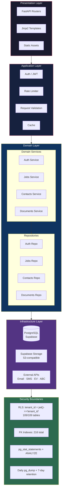

```mermaid
graph TB
    subgraph Presentation["Presentation Layer"]
        FR[FastAPI Routers]
        JT[Jinja2 Templates]
        SA[Static Assets]
    end
    
    subgraph Application["Application Layer"]
        AUTH[Auth / JWT]
        RL[Rate Limiter]
        RV[Request Validation]
        CA[Cache]
    end
    
    subgraph Domain["Domain Layer"]
        direction TB
        
        subgraph Services["Domain Services"]
            AS[Auth Service]
            JS[Jobs Service]
            CS[Contacts Service]
            DS[Documents Service]
        end
        
        subgraph Repositories["Repositories"]
            AR[Auth Repo]
            JR[Jobs Repo]
            CR[Contacts Repo]
            DR[Documents Repo]
        end
        
        Services --> Repositories
    end
    
    subgraph Infrastructure["Infrastructure Layer"]
        PG[(PostgreSQL<br/>Supabase)]
        SB[Supabase Storage<br/>S3-compatible]
        EXT[External APIs<br/>Email · SMS · EV · ABC]
    end
    
    Presentation --> Application
    Application --> Domain
    Domain --> Infrastructure
    
    subgraph Security["Security Boundaries"]
        RLS["RLS: tenant_id = jwt()->>'tenant_id'<br/>109/109 tables"]
        FI["FK Indexes: 216 total"]
        PS["pg_stat_statements + ANALYZE"]
        BK["Daily pg_dump + 7-day retention"]
    end
    
    Infrastructure --> Security
    
    style Presentation fill:#1a1a2e,stroke:#e94560,color:#fff
    style Application fill:#16213e,stroke:#e94560,color:#fff
    style Domain fill:#0f3460,color:#fff
    style Infrastructure fill:#533483,color:#fff
    style Security fill:#2d6a4f,color:#fff
```
